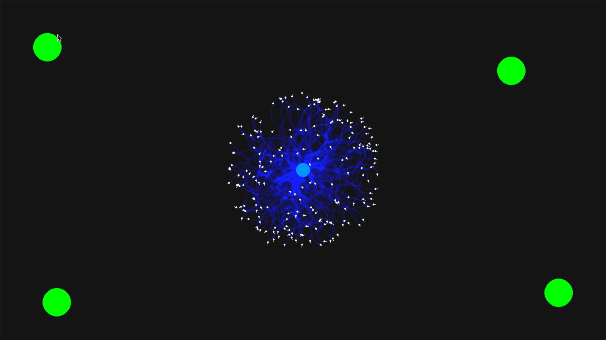

# Emergent Mind: An Ant Colony Simulation

 

This project is not just another ant colony optimization algorithm. It is a scientific simulation built in Python and Pygame to explore a fundamental hypothesis: **What if intelligence is not a product of complex computation, but an emergent property of simple physical laws interacting with an environment?**

Through a process of iterative discovery, this simulation models a collective intelligence that arises from a few core principles, culminating in a system that can learn, solve problems, and even "unlearn" bad habits.

## The Core Principles ("The Laws of Physics")

This simulation's behavior is not hard-coded. It emerges from the interaction of agents (ants) and their environment (pheromone grid) governed by these fundamental laws:

1.  **The Law of Environmental Memory (Stigmergy):** Agents leave traces (pheromones) in their environment. These traces act as an external, collective memory that influences the behavior of other agents.
2.  **The Law of a Global Goal (Gravity):** When carrying food, agents possess a weak, innate sense of direction towards their home. This "nest gravity" acts as a global compass, preventing the system from getting completely lost in local pheromone loops.
3.  **The Law of Forgetting (Evaporation & Diffusion):** Information is not permanent. Pheromone trails decay and blur over time. This crucial law allows the colony to forget old, inefficient, or irrelevant paths, making the system adaptable to change.
4.  **The Law of Systemic Failure (Mental Fatigue & Panic):** This is the key discovery of the project. An agent caught in a repetitive loop (walking the same trail without reaching a goal) experiences "mental fatigue." Its patience runs out, triggering a short-lived "panic" state where it ignores all environmental signals and moves randomly. This allows the agent—and by extension, the colony—to break out of otherwise inescapable, ritualistic loops.

## Features
*   Dynamic, real-time simulation of ant foraging behavior.
*   Pheromone trails that evaporate and diffuse realistically.
*   Emergent pathfinding that automatically discovers shortest routes.
*   A novel "Mental Fatigue" and "Panic" mechanism to prevent systemic gridlock.
*   Interactive environment: add food sources by clicking the mouse.

## How to Run
This project uses Python with the Pygame, NumPy, and SciPy libraries.

1.  **Clone the repository:**
    ```bash
    git clone https://github.com/lrdcxdes/ant-simulation.git
    cd emergent-mind
    ```

2.  **Install the dependencies:**
    ```bash
    pip install -r requirements.txt
    ```

3.  **Run the simulation:**
    ```bash
    python sim.py
    ```

## Experimentation
The true power of this simulation lies in experimentation. You can change the "laws of physics" by tweaking the constants at the top of the `sim.py` file.

*   `ANT_COUNT`: How does the size of the colony affect its efficiency?
*   `EVAPORATION_RATE`: What happens if the colony's memory is too short or too long?
*   `NEST_GRAVITY_STRENGTH`: Can the colony function without a global goal?
*   `MAX_PATIENCE` & `PANIC_DURATION`: How does the system's tolerance for failure affect its ability to solve problems?

## Contributing
Contributions, issues, and feature requests are welcome. Feel free to check the [issues page](https://github.com/lrdcxdes/ant-simulation/issues).

## License
This project is licensed under the MIT License. See the `LICENSE` file for details.